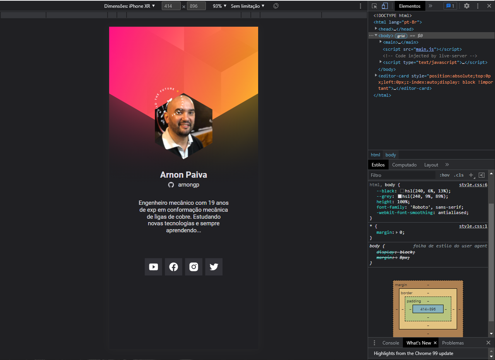

# Trilha `<nlw>`Heat - Mission:Origin

Trilha oferecida pelo Rocketseat na `<nlw>7` [Origin](https://app.rocketseat.com.br/nlw-heat/tracks). O projeto consiste na a contrução do crachá virtual que será utilizado no evento 'Do While' da Rocketseat.

## Tecnologias utilizadas

- HTML
- CSS
- Javascript
  - Consumo de API do Github para iteração na página
  - JSON

## Imagem do projeto

---

### Instrutores

- Mayk Brito
- Jake Gracielly
